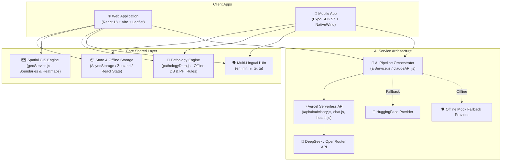
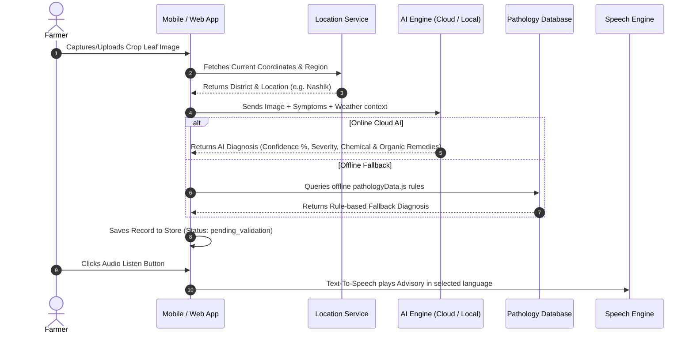
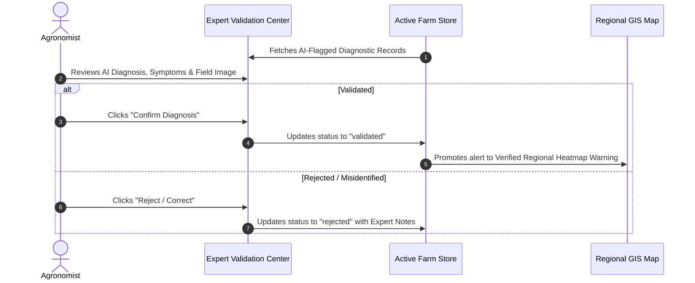

# 🌾 CropShield AI — Complete System Architecture & Project Guide

CropShield AI is an intelligent, multi-platform agricultural pathology early-warning and diagnostic ecosystem designed for Indian agriculture. It equips farmers, agronomists, and extension workers with real-time AI disease diagnostics, spatial GIS risk heatmaps, localized weather-based outbreak forecasting, and an expert validation pipeline.

---

## 📐 System Architecture Overview

CropShield AI operates as a unified multi-platform system consisting of a **Web Application (Vite + React)**, a **Mobile Application (Expo + React Native)**, **Vercel Serverless AI Endpoints**, and an **Offline-First Knowledge Engine**.



---

## 🛠️ Tech Stack & How Components Link Up

### 1. Web Platform (`CROPSHIELD_AI`)
| Technology | Role & Integration |
| :--- | :--- |
| **React 18 & Vite** | Lightning-fast frontend SPA rendering and hot module reloading. |
| **TailwindCSS & PostCSS** | Custom agricultural palette (`soil-dark`, `field-green`, `parchment-light`, `harvest-gold`). |
| **Leaflet & React-Leaflet** | Interactive GIS mapping, farm region boundaries, disease cluster markers, and heatmaps (`leaflet.heat`). |
| **Recharts** | Visualizing 7-day risk trends, humidity/temperature curves, and disease severity statistics. |
| **React-i18next** | Dynamic language switching across 5 languages without full page reload. |
| **Lucide React** | Consistent, high-accessibility UI icons. |

### 2. Mobile App (`CROPSHIELD_MOBILE`)
| Technology | Role & Integration |
| :--- | :--- |
| **Expo SDK 57 & React Native** | Cross-platform mobile runtime targeting Android, iOS, and Web. |
| **Expo Router v4** | File-based routing located under `./app` (`(tabs)`, `expert`, `result`). |
| **NativeWind v4** | Tailwind CSS styling for React Native components. |
| **Expo Image Picker** | Access to mobile camera and photo gallery for crop leaf upload. |
| **Expo Location** | Hardware GPS reverse-geocoding for precise field location tagging. |
| **Expo Speech** | Text-To-Speech (TTS) audio narration of diagnosis and safety instructions in regional accents (`mr-IN`, `hi-IN`). |
| **AsyncStorage** | Persistent local key-value store for farm profiles, diagnostic logs, and offline alerts. |

### 3. Serverless Backend & AI Layer (`/api/ai`)
| File / Endpoint | Purpose |
| :--- | :--- |
| `api/ai/advisory.js` | Serverless route executing tailored agronomic advisory prompts via DeepSeek / OpenRouter. |
| `api/ai/chat.js` | Backend endpoint for **Krishimitra AI**, the multi-turn conversational farmer assistant. |
| `api/ai/health.js` | System diagnostic route checking API latency and provider availability. |

---

## 🔄 Core User Workflows

### Workflow 1: AI Pathology Diagnosis



---

### Workflow 2: Agronomist Expert Validation Pipeline



---

## 📁 File Directory Map & File Purpose

Below is the complete inventory of files in both project roots, detailing the purpose of each component.

### 🌐 Web Platform Files (`CROPSHIELD_AI/`)

```
CROPSHIELD_AI/
├── api/                             # Serverless API routes (Vercel)
│   └── ai/
│       ├── advisory.js              # Generates structured IPM & agronomic advisories
│       ├── chat.js                  # Handles Krishimitra conversational AI chat requests
│       └── health.js                # API health status checker endpoint
│
├── public/                          # Public static assets
│   ├── favicon.ico
│   └── manifest.json                # Web App Manifest for PWA installation
│
├── src/
│   ├── components/                  # UI Component Library
│   │   ├── advisory/                # Advisory cards & IPM protocol views
│   │   ├── dashboard/               # Dashboard widgets, stats summary, Expert Validation UI
│   │   ├── diagnosis/               # Image uploader, symptom checklist, diagnostic result modal
│   │   ├── forecast/                # Weather widgets & risk gauge charts
│   │   ├── krishimitra/             # Voice-enabled AI Chatbot modal & audio visualizer
│   │   ├── layout/                  # Header bar, Navigation tabs, Footer, Language picker
│   │   ├── map/                     # Leaflet map container, Heatmap overlay, Active alerts sidebar
│   │   ├── support/                 # Community forum, hotline contact cards
│   │   └── ui/                      # Base UI primitives (Buttons, Cards, Badges, ErrorBoundary)
│   │
│   ├── data/                        # Static datasets & mock records
│   ├── hooks/                       # Custom React hooks (useWeather, useLocation, useTranslation)
│   ├── i18n/                        # i18next configuration setup
│   ├── locales/                     # Dictionary JSON files
│   │   ├── en.json                  # English translations
│   │   ├── mr.json                  # Marathi translations (मराठी)
│   │   ├── hi.json                  # Hindi translations (हिंदी)
│   │   ├── te.json                  # Telugu translations (తెలుగు)
│   │   └── ta.json                  # Tamil translations (தமிழ்)
│   │
│   ├── pages/                       # Application Views
│   │   ├── Home.jsx                 # Main landing page with system status & feature spotlights
│   │   ├── Dashboard.jsx            # Farm health summary & regional alert feed
│   │   ├── Diagnose.jsx             # Comprehensive multi-step AI diagnosis workflow
│   │   ├── Map.jsx                  # Fullscreen spatial GIS map & risk heatmap
│   │   ├── Forecast.jsx             # 7-day weather & disease risk prediction
│   │   ├── Advisory.jsx             # Customized IPM advisory generator
│   │   └── FarmerSupport.jsx        # Krishimitra AI assistant & emergency extension hotline
│   │
│   ├── services/                    # Business Logic & External Integrations
│   │   ├── ai/                      # AI Service Engine
│   │   │   ├── aiService.js         # Unified AI coordinator (handles provider selection)
│   │   │   ├── deepSeekProvider.js  # DeepSeek AI provider client
│   │   │   ├── huggingFaceProvider.js # HuggingFace inference client
│   │   │   ├── mockProvider.js      # Offline mock fallback generator
│   │   │   └── prompts/             # System prompt templates for advisory & diagnosis
│   │   ├── claudeAPI.js             # Direct API caller for Claude / Vision inference
│   │   ├── geoService.js            # GIS GeoJSON boundaries & spatial distance calculators
│   │   ├── pathologyData.js         # Master offline disease database (Downy Mildew, Blight, etc.)
│   │   └── weatherAPI.js            # Open-Meteo / Weather API integration
│   │
│   ├── store/                       # Application State Management
│   │   └── useFarmStore.js          # Central React store for farm profile, alerts & diagnoses
│   │
│   ├── App.jsx                      # Main app shell, navigation router, and layout wrapper
│   ├── main.jsx                     # Vite React DOM entry point
│   └── index.css                    # Tailwind CSS directives & global color system
│
├── package.json                     # Dependencies & npm build scripts
├── tailwind.config.js               # Color tokens & theme extension rules
└── vite.config.js                   # Vite server & build configuration
```

---

### 📱 Mobile Platform Files (`CROPSHIELD_MOBILE/`)

```
CROPSHIELD_MOBILE/
├── app/                             # Expo Router Navigation App Root
│   ├── (tabs)/                      # Tab Bar Screen Group
│   │   ├── _layout.tsx              # Custom styled tab bar layout (Dashboard, Diagnose, Advisory)
│   │   ├── index.tsx                # Mobile Dashboard screen (Farm status, total acres, active alerts)
│   │   ├── diagnose.tsx             # Camera/Gallery diagnosis screen with GPS locate button
│   │   └── advisory.tsx             # Mobile advisory screen
│   │
│   ├── _layout.tsx                  # Root app layout (Stack navigator, i18n & store initialization)
│   ├── index.tsx                    # Entry redirect router (`<Redirect href="/(tabs)" />`)
│   ├── expert.tsx                   # Expert Validation Center for agronomists
│   └── result.tsx                   # Detailed Diagnostic Report screen with Text-to-Speech audio
│
├── src/                             # Shared Mobile Modules
│   ├── components/                  # Native UI components
│   ├── constants/                   # Theme dimensions, spacing, color tokens
│   ├── hooks/                       # Mobile-specific custom hooks (useColorScheme, useTheme)
│   ├── i18n/                        # Mobile i18n instance
│   ├── locales/                     # Language translation JSONs (mr, hi, te, ta, en)
│   ├── services/                    # Shared pathology, weather, and AI services
│   └── store/                       # State Management
│       └── farmStore.js             # AsyncStorage-backed store for mobile persistence
│
├── app.json                         # Expo configuration (slug, plugins, native permissions)
├── babel.config.js                  # Babel presets for NativeWind & Reanimated
├── tailwind.config.js               # NativeWind Tailwind CSS config
└── package.json                     # Mobile npm dependencies (Expo SDK 57, React Native 0.86)
```

---

## 🎨 Color Palette & UI Token System

Both Web and Mobile platforms adhere to a unified natural agricultural color scheme:

| CSS Token Name | Hex Code | Purpose |
| :--- | :--- | :--- |
| **`soil-dark`** | `#1C1A14` | Primary headers, high-contrast dark text, dark mode backgrounds |
| **`field-green`** | `#2D5A1B` | Primary call-to-action buttons, safe status indicators, active tabs |
| **`parchment-light`** | `#F5F0E8` | Main application background (soft paper texture aesthetic) |
| **`harvest-gold`** | `#D4A017` | Warning badges, accent highlights, tab active indicators |
| **`danger-red`** | `#B03A2E` | Critical disease alerts, high-severity flags, reject buttons |
| **`sky-blue`** | `#2A5D91` | Weather indicators, location badges, informational links |
| **`mist`** | `#E8ECE9` | Card inner containers, subtle borders, input background fills |

---

## 🚀 How to Run the Project Locally

### Running the Web Application
```bash
# In the root project directory (CROPSHIELD_AI)
npm install
npm run dev
# Web application will run at http://localhost:5173
```

### Running the Mobile Application (Web Preview / Expo Dev Server)
```bash
# Navigate to the mobile directory
cd CROPSHIELD_MOBILE
npm install
npm run web
# Mobile Expo Web app will run at http://localhost:8081
```

---

## 🔒 Safety & PHI (Pre-Harvest Interval) Compliance

CropShield AI places heavy emphasis on agricultural safety:
1. **Chemical Safety Guidance**: Every chemical recommendation lists its exact **PHI (Pre-Harvest Interval in days)** to ensure pesticide residue compliance before harvest.
2. **Organic First**: Integrated Pest Management (IPM) advisories always prioritize non-chemical, bio-fungicide (e.g. *Trichoderma viride*, Neem oil) alternatives first.
3. **Agronomist Oversight**: AI diagnostic predictions are flagged as `pending_validation` until reviewed by an expert agronomist, preventing false-positive treatments.
